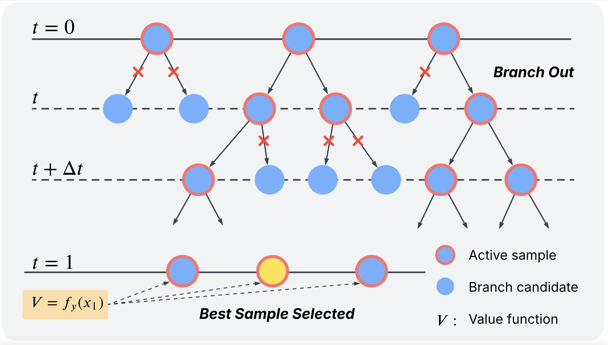
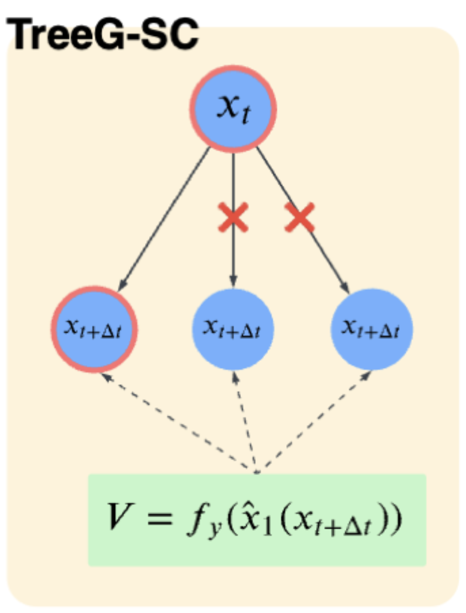
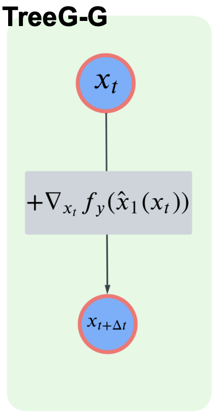
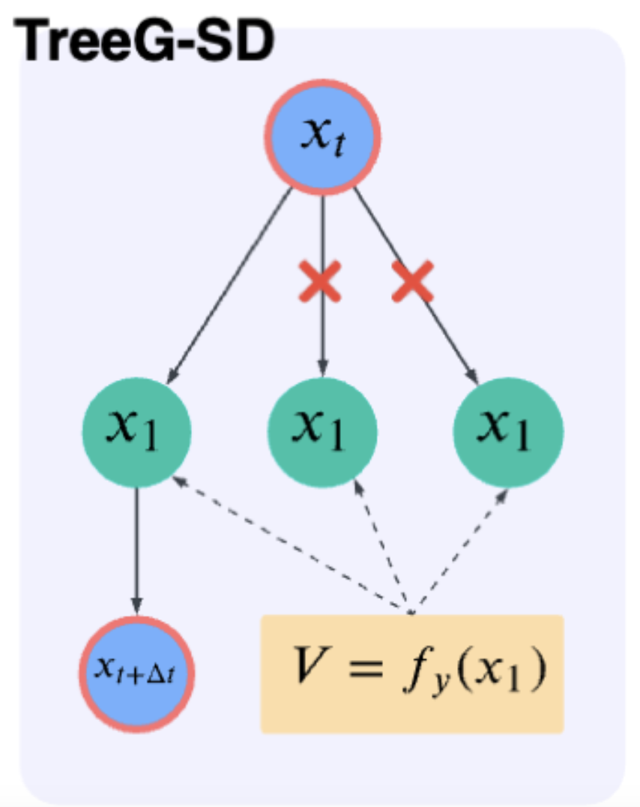

<h1 align='center' style="text-align:center; font-weight:bold; font-size:2.0em;letter-spacing:2.0px;"> Training-Free Guidance Beyond Differentiability:<br>Scalable Path Steering with Tree Search in Diffusion and Flow Models </h1>

<p align='center' style="text-align:center;font-size:1.25em;"> 
    <a href="https://scholar.google.com/citations?user=vfVcl2YAAAAJ&hl=en" target="_blank" style="text-decoration: none;">Yingqing Guo*</a>, &nbsp; 
    <a href="https://scholar.google.com/citations?user=ASZWVzEAAAAJ&hl=en" target="_blank" style="text-decoration: none;">Yukang Yang*</a>, &nbsp; 
    <a href="https://hhhhuiyuan.github.io" target="_blank" style="text-decoration: none;">Hui Yuan*</a>, &nbsp; 
    <a href="https://mwang.princeton.edu/" target="_blank" style="text-decoration: none;">Mengdi Wang</a>&nbsp
    <br/>  
Princeton University (* Equal Contribution)
  <br/> <br/> 
<b>NeurIPS 2025</b>
</p>

<p align='center' style="text-align:center;font-size:2.5 em;">
<b>
    <a href="https://openreview.net/pdf?id=nqVLJTPoQC" target="_blank" style="text-decoration: none;">Openreview</a>&nbsp;
</b>
</p>

## Introduction


<span style="font-size: 1.1em;">
We proposed <b>TreeG</b>, a training-free tree-search guidance framework which <br>
(1) supports both diffusion and flow models for continuous and <b><i>discrete</i></b>  data <br>
(2) can handle <b><i>non-differentiable</i></b> objectives</span>
<br><br>
<div align="center">
<table style="width: 90%; border: none; border-collapse: collapse;">
  <tr>
    <td rowspan="2" style="border: none; width: 70%;">
      
    <br>
    <!-- <b>(a)</b> -->
    </td>
    <td style="border: none; width: 30%;">
      
    </td>
    <!-- <td style="border: none; width: 20%;">
      
    </td> -->
  </tr>
  <tr>
    <td style="border: none; width: 30%;">
      
    </td>
    <!-- <br>
    <b>(b)</b> -->
  </tr>
  <tr>
    <td colspan="2" style="border: none;">
      <!-- <h3> -->
      <b>TreeG Overview.</b> <br><b><i>Left</i></b>: An active set of size <i>A</i> is maintained, where each sample branches into <i>K</i> candidates. At each step, the top <i>A</i> candidates are retained, and the best sample is selected at the final step. <br> <b><i>Right</i></b>: Two implementations of <i>Branch Out</i> operations which do not require a differentiable objective predictor (1) <b>TreeG-SC</b> which samples <i>K</i> candidates at next denosing time step and then evaluates them through a lookahead estimate of corrsponding clean samples. <b>TreeG-SD</b> which applies branching and selection in the
destination state space. Additionally, if a differentiable objective predictor is available, gradient-based guidance can be also applied to the current state as a <i>Branch Out</i> operation for proposing candidates at next time steps (<b>TreeG-G</b>).
<!-- branch-out. -->
      <!-- </h3> -->
    </td>
  </tr>
</table>
</div>


<div align="left">


## News

**2025.09.18** Our paper has been accepted by NeurIPS 2025. The code is coming soon!
**2025.12.02** The code for music generation and small molecule generation is released. 

## 🎵 Symbolic Music Generation 
We used <b><i>continuous diffusion</i></b> models for generating symbolic music following the paper [Symbolic Music Generation with Non-Differentiable Rule Guided Diffusion](https://arxiv.org/abs/2402.14285). The targets are
pitch histogram, note density, and
chord progression. The objective functions for note density and chord progression are <b><i>non-differentiable</i></b>.

Please refer to [music readme](music/README.md) for details. 

## ⚛️ Small Molecule Generation


Please refer to [discrete flow readme](discrete_flow/README.md) for details. 

## 🧬 Enhancer DNA Design
Coming Soon ......


## :e-mail: Contact

For help or issues about the code, please email Yukang Yang (yy1325@princeton.edu) and Yingqing Guo (yg6736@princeton.edu
) or submit a GitHub issue.


## 📚 References
Please consider citing the following paper when using our code:

```bibtex
@article{guo2025training,
  title={Training-free guidance beyond differentiability: Scalable path steering with tree search in diffusion and flow models},
  author={Guo, Yingqing and Yang, Yukang and Yuan, Hui and Wang, Mengdi},
  journal={arXiv preprint arXiv:2502.11420},
  year={2025}
}
